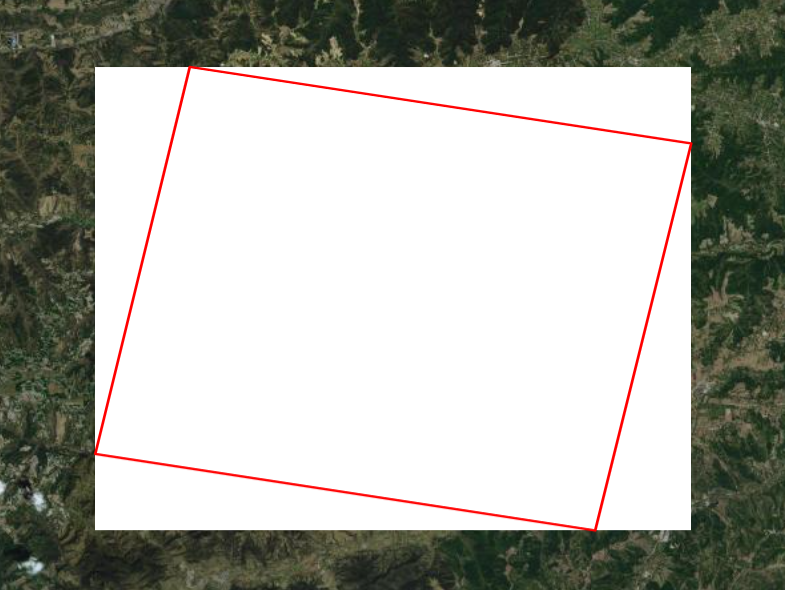
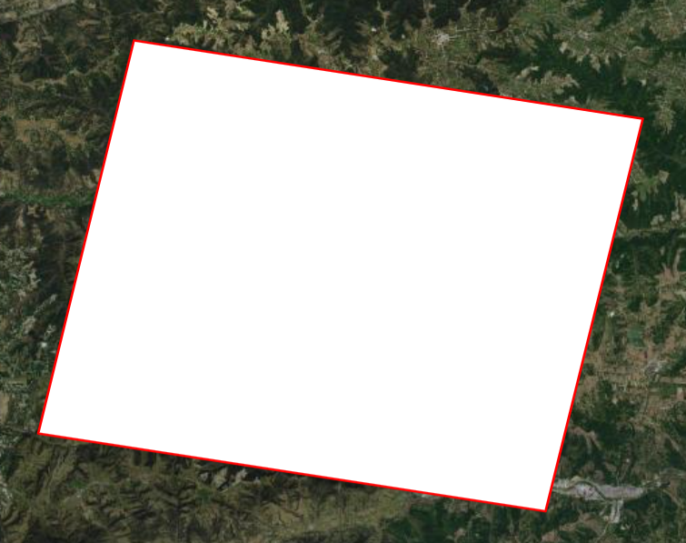

## gmcTransf.js

javascript实现的一个影像快视图几何变换（仿射变换和透视变换）的库。

在前端加载影像快视图时，有时会遇到未经变换处理的快视图，这导致快视图与落图无法套合。为此，提供了一个解决方案，以解决这一问题。

<!-- <div style="display: flex;justify-content: space-around;align-items: center;">
  <div style="text-align: center;margin: 10px;">
    
    <p>处理前，不能跟落图套合</p>
  </div>
  <div style="text-align: center;margin: 10px;">
    
    <p>处理后，可以跟落图套合。</p>
  </div>
</div> -->
|  | |
|:---------------------------:|:------------------------:|
| 处理前，不能跟落图套合        | 处理后，可以跟落图套合     |

## Install

```sh
npm install gmcTransf
```

## API Reference

浏览器导入

```html
<script src="gmcTransf.js"></script>
<script src="gmcTransf.min.js"></script>
```

```javascript
// gmcTransf有两个方法affine和persp

gmcTransf.affine = function (geom, url, cb) {
  cb({
    imageExtent: [],
    url: "",
  });
};
/**
 * 对图片进行仿射变换。使用三个点进行图片变换
 * 优点：计算量相对较少，使用canvas的transform实现
 * 缺点：误差相对较大
 * @param {array} geom - 落图的范围
 * @param {string} url - 图片的url
 * @param {function} cb - 图片处理完成之后的回调函数
 * @returns {object} 包含处理后的图片和bbox
 * @returns {array} .imageExtent - 图片的bbox
 * @returns {string} .url - 处理后图片的url
 */
gmcTransf.persp = function (geom, url, cb) {
  cb({
    imageExtent: [],
    url: "",
  });
};
/**
 * 对图片进行透视变换。使用四个点对图片进行透视变换
 * 优点：计算量相对较大
 * 缺点：误差相对较小
 * @param {array} geom - 落图的范围
 * @param {string} url - 图片的url
 * @param {function} cb - 图片处理完成之后的回调函数
 * @returns {object} 包含处理后的图片和bbox
 * @returns {array} .imageExtent - 图片的bbox
 * @returns {string} .url - 处理后图片的url
 */
```

## Use
以 openlayer 加载快视图为例

```javascript
// 前端加载
<script src="gmcTransf.1.2.1.js"></script>;

//快视图的落图
let geom = [
  [x1, y1],
  [x2, y2],
  [x3, y3],
  [x4, y4],
  [x5, y5],
];
// 对图片进行透视变换，加载图片。
gmcTransf.persp(geom, img_url, (obj) => {
  const imageLayer = new ol.layer.Image({
    source: new ol.source.ImageStatic(obj),
  });
  map.addLayer(imageLayer);
});
```
